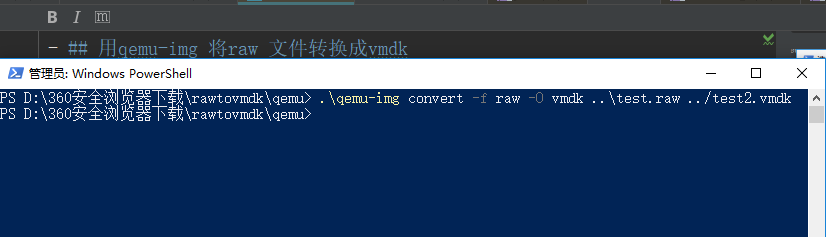
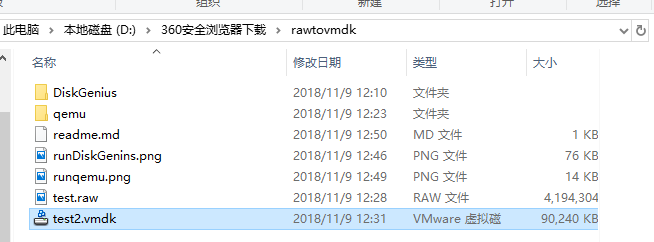
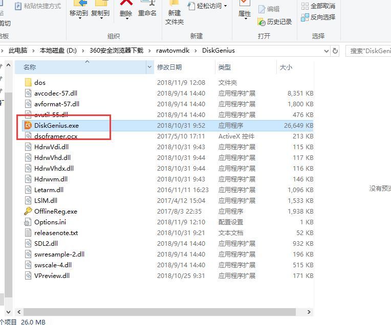
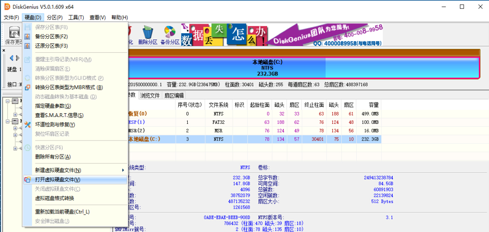
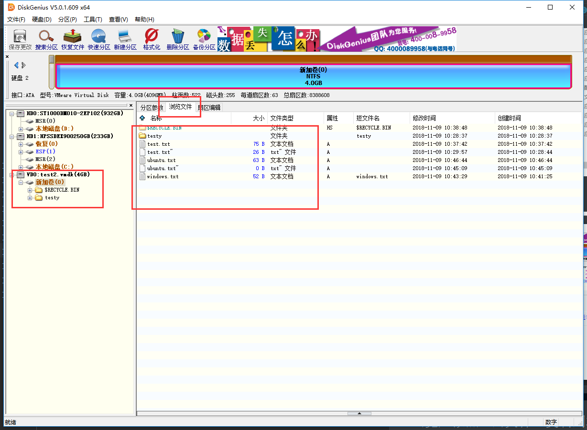
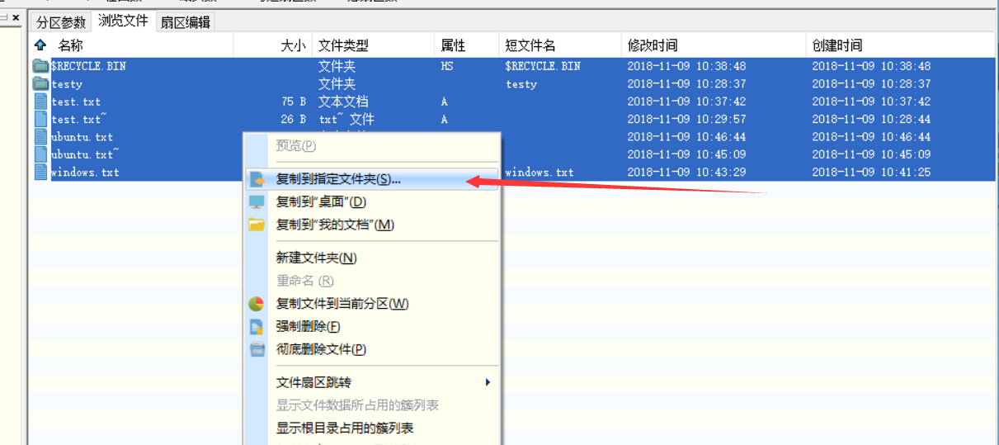

# 说明文件，注意这个文件是markdown格式文件，需要用markdown阅读器获得最佳体验，建议使用vscode 或 phpstorm  
---
##### *如果图片看不到则是:`avatars3.githubusercontent.com` dns解析不了，所以要用[地址解析](https://www.ipaddress.com/)到ip然后手动修改`hosts`文件生效*

- ## 用qemu-img 将raw 文件转换成vmdk
> 用powershell或cmd窗口 在qemu-img.exe所在路径运行：` ./qemu-img` 具体命令如下：  
```
    ./qemu-img convert -f raw -O vmdk ../test.raw ../yourdefine.vmdk 
```

#### ** 等待，转换成功后，就可以在目录看到 `yourdefine.vmdk`,我用的名字是`test2.vmdk` **  


* ## 用disk-genius工具将vmdk 虚拟磁盘打开
> 去`disk-genius`目录，  
>- ### 双击`DiskGenius.exe`打开磁盘管理工具 
 
> - ### 选择转换好的yourdefine.vmdk 



* ## 浏览虚拟磁盘的文件，复制到本地物理磁盘


